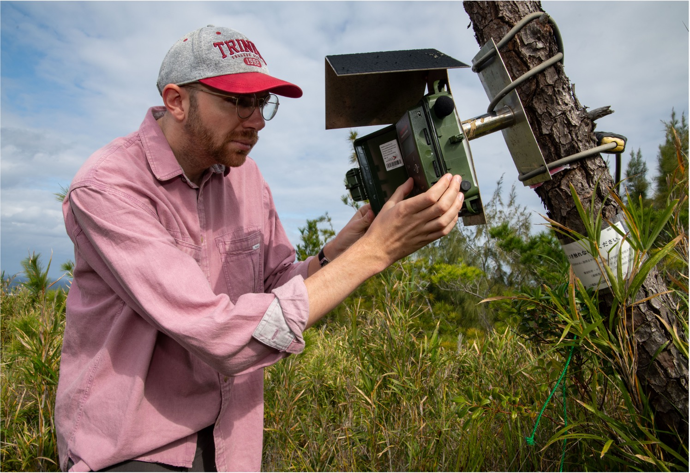

::: {.hero}
::: {.hero-copy}

ECOLOGICAL STABILITY · RESPONSE DIVERSITY · ECOACOUSTICS

# What drives ecological stability?

Samuel R.P-J. Ross

Community ecology · Global change

:::

::: {.hero-image}

:::
:::

::: {.intro-grid}

::: {.intro-lead}
I study why some ecosystems remain stable or can rapidly recover from environmental change, while others collapse.
:::

::: {.intro-text}
I'm an Associate Professor in the Hakubi Center for Advanced Research and Graduate School of Agriculture at Kyoto University in Japan. My research combines ecological concepts and methods with high-resolution data to understand the mechanisms underpinning ecological stability.

生態系の安定性・レジリエンス・応答多様性・生態音響学
:::

:::

## Research

::: {.research-cycle}

::: {.research-grid}

::: {.research-card .research-rd}

01

RESPONSE DIVERSITY

<h3>Exploring concepts and methods for predicting stability</h3>

Understanding biological insurance mechanisms, such as how differences among organisms' responses to environmental change can generate stability.

<a href="research.qmd#response-diversity">Find out more →</a>

:::
 

::: {.research-card .research-acoustic}

02

ECOACOUSTICS

<h3>Ecological big data for measuring real-world stability and change</h3>

Using passive acoustic monitoring of natural soundscapes to observe ecosystem dynamics across spatial and temporal scales relevant to ecosystem management.

<a href="research.qmd#ecoacoustics">Find out more →</a>

:::

:::

:::

## Recent publications

::: {#recent-publications}
:::

<a href="publications.qmd">View all publications →</a>

::: {.contact-strip}

  
FIND ME

  
Haubi Center for Advanced Research & Graduate School of Agriculture, Kyoto University · Kyoto, Japan

  <a href="https://orcid.org/0000-0001-9402-9119">ORCID</a>
  <a href="https://scholar.google.co.uk/citations?user=R3aMfY0AAAAJ&hl=en">Scholar</a>
  <a href="https://x.com/SamRPJRoss">X</a>
  <a href="https://github.com/SamRPJRoss">GitHub</a>
  <a href="https://www.researchgate.net/profile/Samuel-Ross-4">ResearchGate</a>

:::
