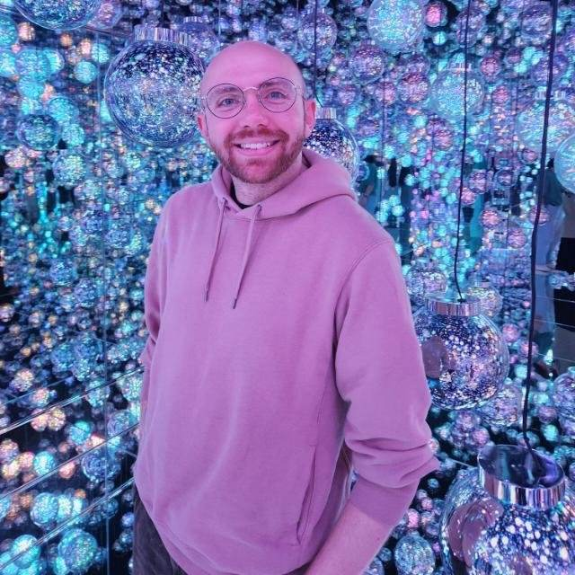
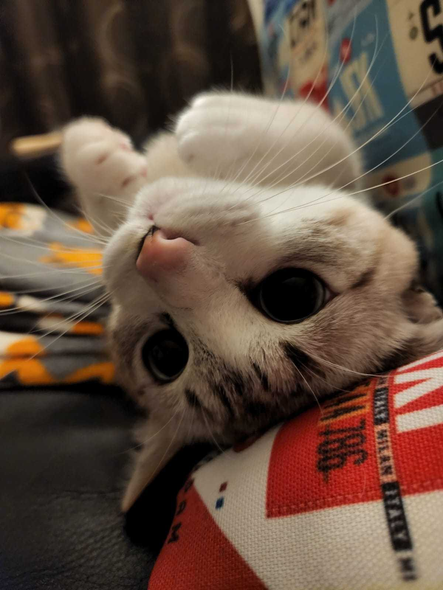

  <h2 class="person-name">Dr Samuel R.P-J. Ross</h2>
  He/Him

ロス・サムエル

<strong>Associate Professor</strong> | 特定准教授

<strong>Email:</strong> s.ross.res [at] outlook.com

**PhD** (Trinity College Dublin, Ireland)  
**MBiol, BSc** (University of Leeds, UK)

Hakubi Center for Advanced Research
Graduate School of Agriculture (concurrent)  
**Kyoto University**

Kitashirakawa Oiwake-cho, Sakyo-ku, Kyoto, 606-8502 Japan

白眉センター  
農学研究科 (兼任)  
**京都大学**

〒606-8502 京都市左京区北白川追分町

I’m interested in the abiotic and biotic drivers of ecological stability. Specifically, I develop concepts and methods for assessing the role of response diversity in driving stability, and I use ecoacoustic data to quantify ecosystem dynamics, change, and stability in real-world ecosystems. In my spare time, I enjoy reading, going to the cinema, drinking matcha lattes, and being Kyoto's least-requested DJ.

<a href="https://scholar.google.co.uk/citations?user=R3aMfY0AAAAJ&hl=en"
   aria-label="Google Scholar"
   title="Google Scholar">
  <i class="bi bi-mortarboard-fill"></i>
</a>

<a href="https://x.com/SamRPJRoss"
   aria-label="X"
   title="X">
  <i class="bi bi-twitter-x"></i>
</a>

<a href="https://github.com/SamRPJRoss"
   aria-label="GitHub"
   title="GitHub">
  <i class="bi bi-github"></i>
</a>

<a href="https://www.researchgate.net/profile/Samuel-Ross-4"
   aria-label="ResearchGate"
   title="ResearchGate">
  <i class="bi bi-person-lines-fill"></i>
</a>

  <h2 class="person-name">Nacho</h2>
  He/Him

ナチョちゃん

<strong>Research Support Staff</strong> | 研究支援者

Nacho provides essential support. His main research focus is prey capture rates, especially of toy mice and feathers on strings. He likes birdwatching and napping in the sun.

## Past members

<strong>Anthony Gibbons</strong>
Visiting Research Student · Maynooth University, Ireland
Spring 2025

<strong>Chii Kojima</strong>
Research Intern · OIST, Japan
Summer 2023

<strong>Aurika Musiienko</strong>
Research Intern · OIST, Japan
Summer 2023

