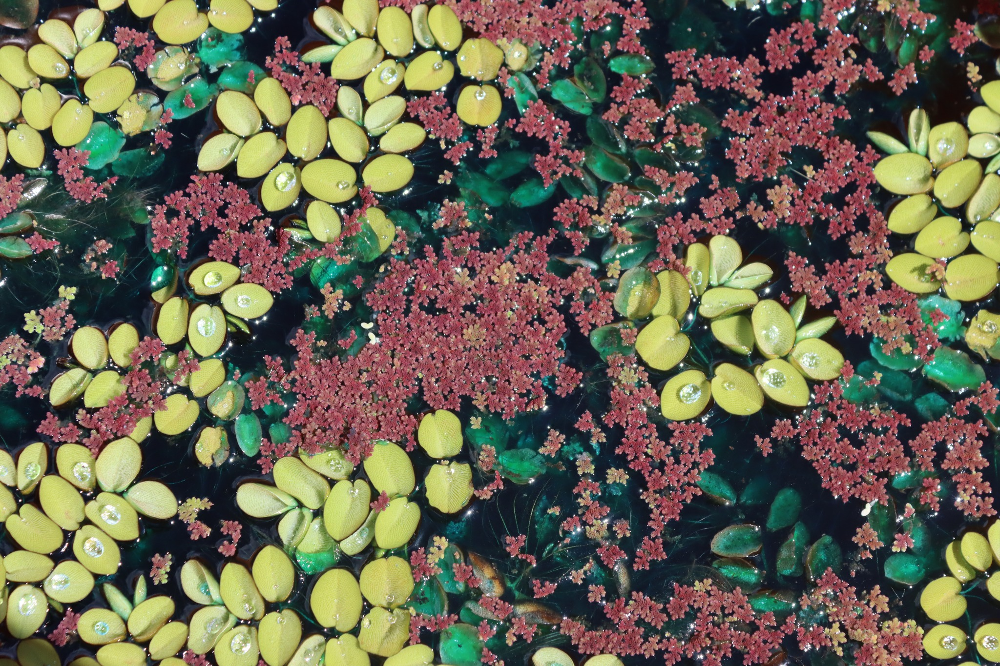
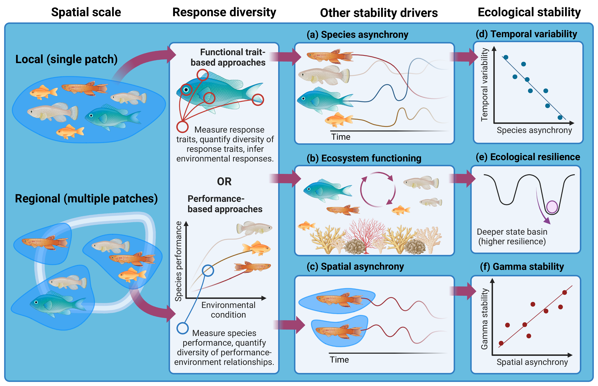
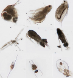
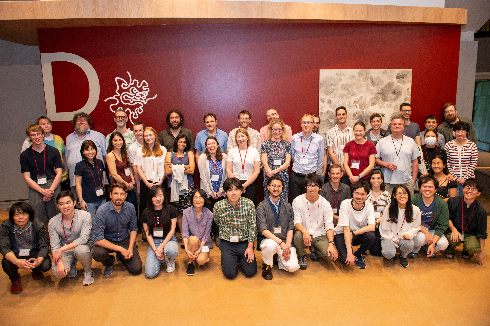
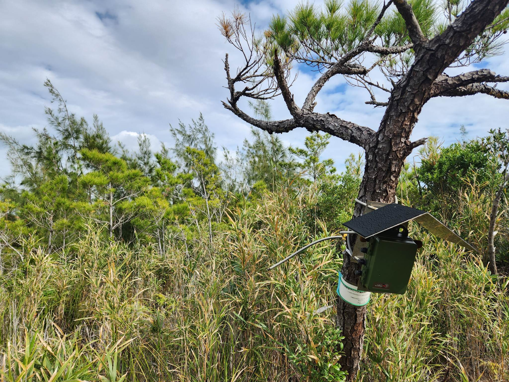
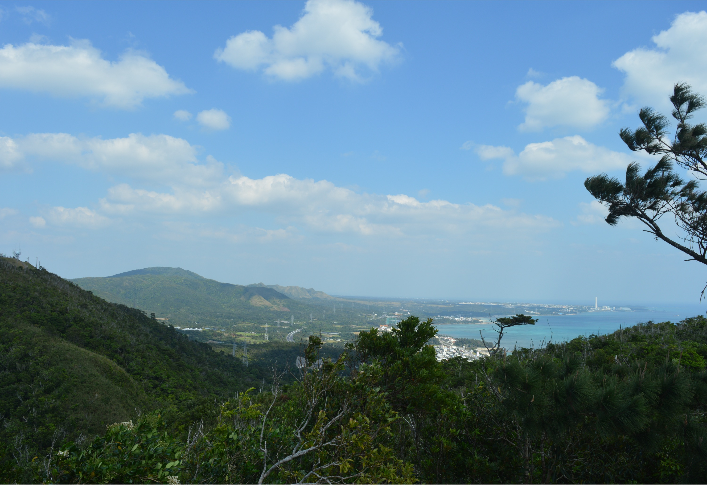
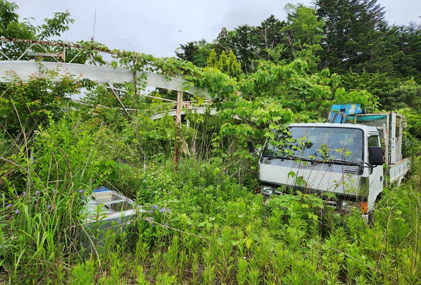
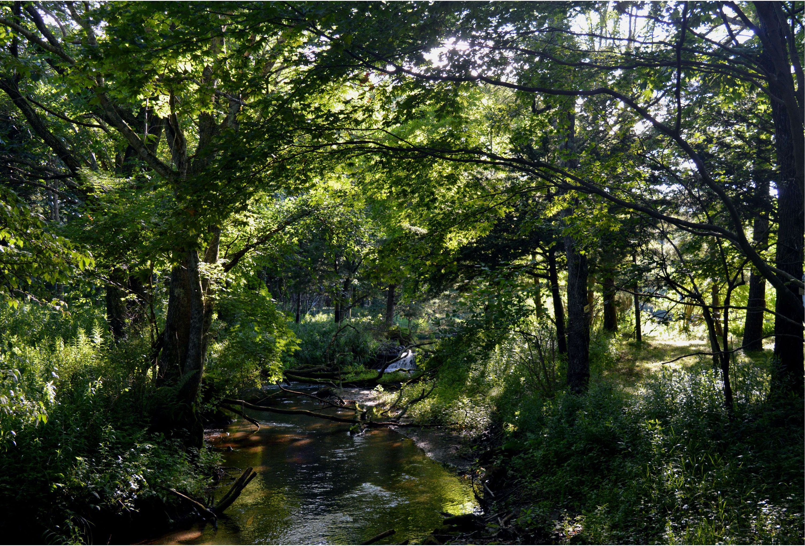

Ecosystems are increasingly exposed to climate change, land-use intensification, invasive species, and other human pressures. Understanding why some ecosystems resist and recover from these changes, while others undergo dramatic or lasting changes, is a central challenge in ecology.

Biodiversity is often associated with more stable ecosystems, but the biological mechanisms behind this relationship remain incompletely understood. At the same time, much of our understanding of stability comes from a relatively narrow range of experimental systems, leaving us with limited ways to measure stability in complex real-world ecosystems.

My research addresses these challenges from two complementary directions: by developing **scalable concepts and methods** for understanding the biological drivers of stability, particularly *response diversity*; and by using **high-resolution ecoacoustic data** to measure stability, change, and recovery in natural systems.

気候変動や土地利用の変化など、さまざまな環境変化に直面する中で、なぜ安定性を保ち回復できる生態系と、大きく変化してしまう生態系があるのでしょうか。私は、「応答の多様性」をはじめとする生物多様性が安定性を生み出す仕組みを明らかにするとともに、音響モニタリングによる高解像度データを活用して、自然生態系の安定性・変化・回復を理解するための研究を進めています。

<!-- ======================================================
     RESPONSE DIVERSITY
     ====================================================== -->

01

## Response diversity {#response-diversity}

### Predicting ecological stability from species responses to environmental change

応答の多様性 ｜ 生態系の安定性を予測するための新たな概念と手法

::: {.research-feature}

:::

Biodiversity can promote ecological stability, but simply knowing which species are present tells us relatively little about *why*. **Response diversity** offers a possible mechanism: it describes variation among organisms in how they respond to environmental change.

When species respond differently to the same environmental pressures, declines in some species can be offset by increases or persistence of others. My research asks how we can measure this variation, when response diversity predicts ecological stability (and when it doesn't), and how this knowledge might ultimately help us understand and manage ecosystems in a changing world.

応答の多様性とは、環境変化に対する生物の応答の違いを表す概念であり、生物多様性が生態系の安定性を支える重要な仕組みの一つと考えられています。私の研究では、応答の多様性を定義・定量化するための概念や手法を開発し、多様な生態系でその一般性を検証するとともに、国際的な研究ネットワーク「[**Response Diversity Network**](https://responsediversitynetwork.github.io/RDN-website/)」を通じて、生態系の理解や管理への応用を目指しています。

### Testing concepts and methods

A major strand of my research develops and tests ways to define, quantify, and interpret response diversity (*e.g.*, [Ross *et al*. 2023, *Methods Ecol. Evol*.](https://doi.org/10.1111/2041-210X.14087)). I am particularly interested in when response diversity can help us understand or predict ecological stability, and how it relates to other aspects of biodiversity, functioning, and service provision.

### Applying across study systems

My work is deliberately system-agnostic. I have studied response diversity in systems ranging from European farmland birds ([White *et al*. 2023, *J. Anim. Ecol*.](https://doi.org/10.1111/1365-2656.14010)) to free-floating aquatic plants ([Ross *et al*. 2026, *bioRxiv*](https://doi.org/10.64898/2026.06.10.731482)), asking which relationships between biodiversity, response diversity, and stability generalise across ecosystems.

### Community-led synthesis

As Deputy Chair of the [**Response Diversity Network**](https://responsediversitynetwork.github.io/RDN-website/) I aim to bring together people interested in how species' responses affect stability ([Ross *et al*. 2026, *Oikos*](https://doi.org/10.1002/oik.11358)). We are collaboratively building conceptual and methodological consensus to make response diversity applicable for ecosystem management.

I am part of the EU-funded MSCA Doctoral Network [**ReDiLEEP**](https://redileep.eu/): Using science-driven **Re**sponse **Di**versity Knowledge to **L**everage **E**fficient **E**cosystem **P**reservation and Restoration. Please see [our website](https://redileep.eu/) for more information on ReDiLEEP vacancies, activities, and outputs.

<!-- ======================================================
     ECOACOUSTICS
     ====================================================== -->

02

## Ecoacoustics {#ecoacoustics}

### High-resolution ecological data for understanding dynamics, stability, and change

生態音響学 ｜ 生態系の安定性・回復・変化を理解するための生態学的ビッグデータ

::: {.research-feature}

:::

If a tree falls in the forest, and no one is around to hear it, does it make a sound? Ecosystems are far from silent; animals, weather, and human activities together create complex soundscapes that change through time with biotic and abiotic environmental changes.

Passive acoustic monitoring allows us to record these soundscapes autonomously at large spatial and temporal scales. My research uses the high-resolution ecological data generated from acoustic sensor networks to study **dynamics, stability, and ecological change in real-world ecosystems**. I combine information about individual vocalising species with community- and soundscape-level summaries.

生態系の音環境（サウンドスケープ）は、生物や気象、人間活動によって形成され、環境の変化とともに時々刻々と変化します。私は音響モニタリングによる高解像度データを活用し、沖縄での台風や土地開発、福島第一原発事故で生じた帰還困難区域における土地の放棄と再定住が生態系に与える影響を研究しています。さらに今後、北海道の河川で、騒音や熱波などの攪乱に対する生態系とサウンドスケープの応答を実験的に検証します。

### Okinawa | 沖縄   
  

TYPHOONS · LAND-DEVELOPMENT · LONG-TERM MONITORING

In Okinawa, we've been recording soundscapes for 10 years. I use this long-term acoustic data to ask how land development and major disturbances such as typhoons shape species and soundscape dynamics through time (*e.g.* [Ross *et al*. 2024, *Glob. Chang. Biol*.](https://doi.org/10.1111/gcb.17067)).

### Fukushima | 福島

LAND ABANDONMENT · HUMAN RESETTLEMENT

In Fukushima, complete abandonment of settlements following the 2011 nuclear disaster provides an unusual opportunity to investigate how human presence — and absence — structures ecological communities and soundscapes.

### Hokkaido | 北海道

FRESHWATER DYNAMICS · PULSE DISTURBANCE

In Hokkaido, I will build on our previous work in Horonai stream ([Ross *et al*. 2022, *Glob. Chang. Biol*.](https://doi.org/10.1111/gcb.15956)) to experimentally measure the responses of ecosystem processes and soundscapes to disturbances such as noise pollution and heatwaves.

This work is supported by a [JST 創発 (FOREST) grant](https://www.jst.go.jp/souhatsu/research/panel_oki.html): ⾳響解析による⽣態系レジリエンス解明 | *Elucidating the drivers of ecosystem resilience through acoustic analysis*.

